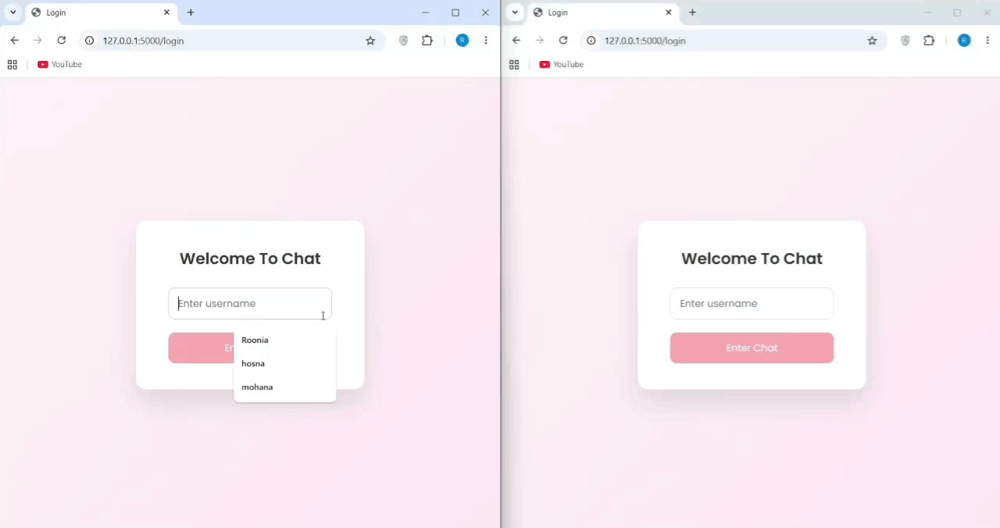

# Web-Socket Messenger

This project is a real-time chat application built with Python. It uses WebSockets to allow multiple users to communicate instantly. The application includes a command-line client and a web interface built with Flask, enabling users to join the chat and exchange messages in real time.



## Sections
- [Features](#features)
- [Project Structure](#project-structure)
- [How It Works](#how-it-works)
- [How to Run](#how-to-run)
- [Messaging Format](#messaging-format)
- [Contributors](#contributors)


## Features
- Multi-client Chat System : Handles multiple connections simultaneously using `asyncio`.
- Hybrid Interface : Accessible via a modern Web UI or a simple Terminal client.
- Private Messaging : Direct messaging support using the `@username` tag.
- Real-time Notifications : Instant system messages for user join/leave events.
- Session-based Login : Simple username session management using Flask.
- Unread Badges : Visual indicators for new messages in private rooms.


## Project Structure
```text
PROJECT/
├── flask_app/
│   ├── static/
│   │   ├── chat.css      
│   │   ├── login.css     
│   │   └── script.js       
│   ├── templates/
│   │   ├── chat.html      
│   │   └── login.html     
│   └── app.py             
├── client.py             
├── server.py             
├── output.gif
└── README.md

``` 


## How It Works 
### Server 
The server acts as the central hub of the chat system. It manages connected users and handles both public messages sent to everyone and private messages between specific users, allowing real-time communication between multiple clients.

### Web Client
The web client provides a browser-based chat interface. Users log in through a simple page, connect to the chat server, and can send messages or start private conversations through the interface.

### CLI Client 
The CLI client is a terminal-based version of the chat. It allows users to join the chat and send or receive messages directly from the command line.


## How to Run
### Start the WebSocket Server
- Run the core engine first:
``` 
python server.py
```

### Start the Web Application
- Open a new terminal and run:
```
python flask_app/app.py
```
- Visit http://localhost:5000 in your browser.


### 3. Start CLI Client (Optional)
- To test with a terminal user:
```
python client.py
```


## Messaging Format
### Public Message
- Just type your message and press Enter. It will be sent to everyone.
```
Hello everyone!
```
### Private Message
- Use the @ symbol followed by the target username
```
@username Hi
```


## Contributors
- Hosna Bahramnejad ([GitHub](https://github.com/hosnabahramnejad))
- Roonia Talebi ([GitHub](https://github.com/ROONIAT))

